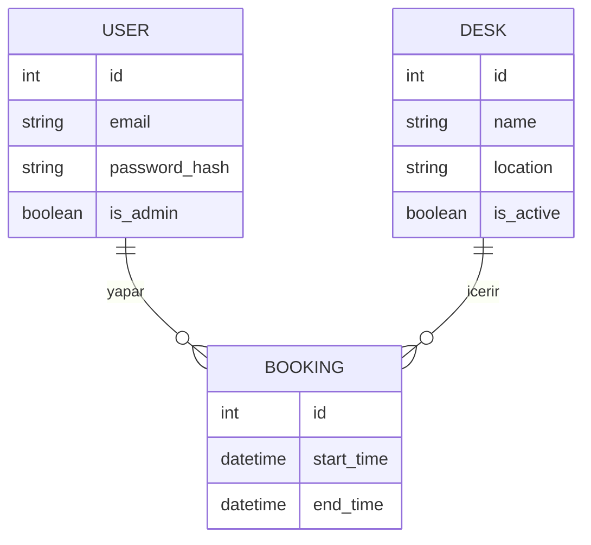

# 💻 SRS - Yazılım Gereksinimleri Spesifikasyonu

**Proje Adı:** DeskSpot API  
**Standart:** IEEE 830  
**Doküman Sürümü:** 1.0.0

---

## 1. Giriş
Bu doküman, DeskSpot API projesinin teknik gereksinimlerini tanımlar. Sistem, RESTful mimarisine sahip, Python/Flask tabanlı bir backend servisidir.

## 2. Fonksiyonel Gereksinimler (Functional Requirements)

### 2.1 Kimlik Doğrulama
* **FR-AUTH-01:** Sistem, kullanıcı şifrelerini veritabanına kaydetmeden önce **PBKDF2/SHA256** algoritması ile hashlemelidir.
* **FR-AUTH-02:** Başarılı girişte sistem, 24 saat geçerli bir **JWT Access Token** dönmelidir.

### 2.2 Masa Yönetimi
* **FR-DESK-01:** Sadece `is_admin=True` yetkisine sahip kullanıcılar `POST /api/desks` endpoint'ini kullanabilir.
* **FR-DESK-02:** Masa eklenirken `name` alanı benzersiz (unique) olmalıdır.

### 2.3 Rezervasyon Yönetimi
* **FR-BOOK-01:** Sistem, rezervasyon isteği geldiğinde tarih aralığı çakışması (Overlap Check) yapmalıdır.
* **FR-BOOK-02:** Çakışma varsa `409 Conflict`, işlem başarılıysa `201 Created` dönmelidir.

## 3. Veri Modeli (ER Diagram)

## 4. İşlevsel Olmayan Gereksinimler (NFR)
* **NFR-SEC-01:** Tüm veri trafiği HTTPS üzerinden şifrelenmelidir.

* **NFR-PER-01:** API yanıt süresi 500ms altında olmalıdır.

* **NFR-PORT-01:** Uygulama Docker konteyneri içinde çalışmalıdır.
