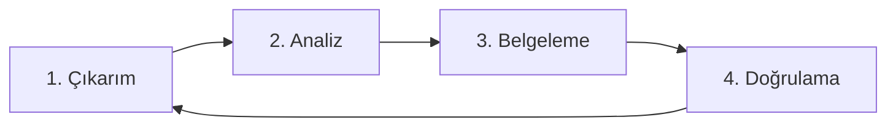

# 📘 Yazılım Gereksinim Mühendisliği Rehberi

Bu rehber, **DeskSpot API** projesinde kullanılan analiz metodolojisini açıklar.

## 1. Gereksinim Süreci Döngüsü

## 2. Kullanılan Teknikler
* **Elicitation (Çıkarım):** Rakip analizleri yapıldı ve ofis yöneticileriyle görüşüldü.

* **Specification (Belgeleme):**

* **BRS:** İş hedefleri için hazırlandı.

* **SRS:** IEEE 830 standardına uygun teknik detaylar yazıldı.

* **Validation (Doğrulama):** RTM matrisi ile her gereksinimin kod karşılığı kontrol edildi.

## 3. Gereksinim Türleri
* **Fonksiyonel:** "Kullanıcı giriş yapabilmeli." (Ne yapar?)

* **Fonksiyonel Olmayan:** "Sistem 1 saniyede açılmalı." (Nasıl çalışır?)
  
## 
* *Hazırlayan: Mustafa Sezen*

* *Tarih: Şubat 2026*
